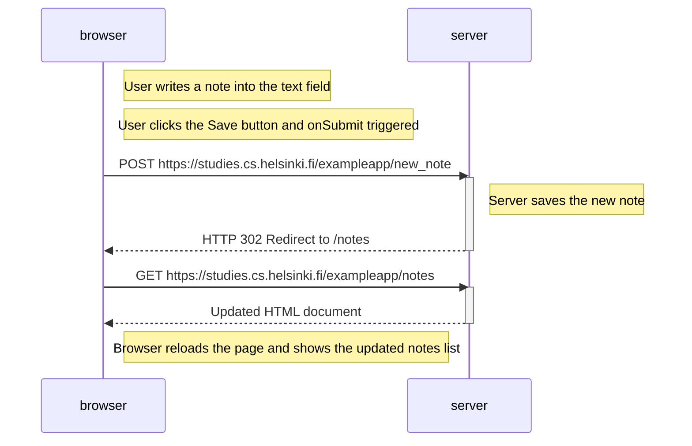

```mermaid
sequenceDiagram
    participant browser
    participant server

    Note right of browser: User writes a note into the text field

    Note right of browser: User clicks the Save button and onSubmit triggered

    browser->>server: POST https://studies.cs.helsinki.fi/exampleapp/new_note
    activate server
    Note right of server: Server saves the new note
    server-->>browser: HTTP 302 Redirect to /notes
    deactivate server

    browser->>server: GET https://studies.cs.helsinki.fi/exampleapp/notes
    activate server
    server-->>browser: Updated HTML document
    deactivate server

    Note right of browser: Browser reloads the page and shows the updated notes list
```
