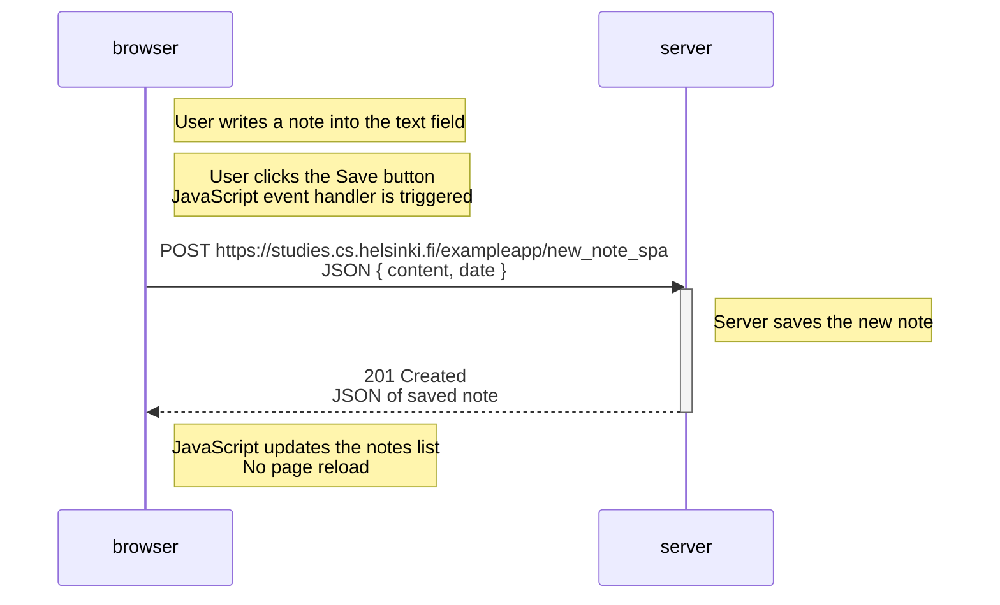

```mermaid
sequenceDiagram
    participant browser
    participant server

    Note right of browser: User writes a note into the text field

    Note right of browser: User clicks the Save button<br/>JavaScript event handler is triggered

    browser->>server: POST https://studies.cs.helsinki.fi/exampleapp/new_note_spa<br/>JSON { content, date }
    activate server
    Note right of server: Server saves the new note
    server-->>browser: 201 Created<br/>JSON of saved note
    deactivate server

    Note right of browser: JavaScript updates the notes list<br/>No page reload

```
